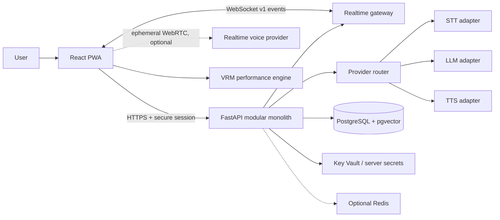

# System architecture

## Purpose

Define component boundaries, data flow, interfaces, and deployment evolution.

## Decision

Use a monorepo and modular monolith. The PWA contains UI, audio capture/playback, avatar engine, local quality governor, event reducer, IndexedDB cache, and service worker. FastAPI modules cover sessions, conversations, realtime gateway, provider router/adapters, prompt assembly, TurnPlan validation, memory/consent, usage, and audit. PostgreSQL + pgvector is authoritative. Optional Redis may hold distributed rate-limit/circuit state only when deployment requires it. S3-compatible object storage is future/production-pilot infrastructure.

The cascade baseline is microphone → Azure-compatible STT → HINAA orchestrator → configured LLM → validated TurnPlan → Azure-compatible TTS + browser performance engine. Provider-direct speech-to-speech is a second path and must translate provider events into the same HINAA protocol.

### Turn ownership

The server owns monotonic event sequence, provider cancellation, persistence, safety and schema validation. The client owns immediate audio stop, render scheduling, duplicate suppression, and reconnection cursor. The model never selects filenames, bones, network endpoints, permissions, or executable tool arguments.

### Provider ports

`LLMProvider`, `RealtimeVoiceProvider`, `STTProvider`, `TTSProvider`, `VisionProvider`, `ImageGenerationProvider`, `EmbeddingProvider`, and `ToolProvider` expose typed capability/health methods. MVP implements mock plus the benchmark winners; non-MVP ports may throw a typed `CAPABILITY_NOT_ENABLED`.

### Dependency direction

Domain contracts have no vendor imports. Adapters depend inward on contracts. HTTP/WebSocket handlers call application services; application services call ports. Direct ORM use is allowed inside each module to avoid repository-pattern ceremony, with transaction boundaries in services.

### Post-MVP module boundaries

**Vision** accepts only an explicit purpose and one user-selected low-resolution frame, produces a labelled untrusted observation, expires source/output storage, and never performs identity or mental-state recognition. A local fixture adapter demonstrates the UI without upload.

**Image/visual generation** uses a provider adapter and durable job states `queued,moderating,running,completed,failed,cancelled,expired`. Input/output moderation brackets provider work; progress is provider-reported or honest indeterminate state; cancellation propagates where supported; generated content is labelled; signed in-chat cards expire; the usage ledger reserves/reconciles cost. Diagrams/charts are rendered only from validated declarative specifications, never model-supplied script/HTML. Downloads use safe filenames, declared MIME, scanning and disposition headers.

**Tools/device control** remains disabled. Future model proposals name an allowlisted capability; deterministic code checks per-user/per-tool/time-limited permission, previews exact side effects, obtains fresh confirmation for send/purchase/delete/publish/account changes, assigns an idempotency key, executes through supported OS APIs, audits result and supports cancellation/safe retry. Read-only is default; there is no shell, hidden action or permission bypass.

## Alternatives considered

Microservices, server-side rendering, GraphQL, mandatory WebRTC, and event sourcing were rejected. REST + WebSocket, client rendering, and an append-only audit table solve current problems with less operational complexity.

## Reasoning

One deployable backend is testable and affordable for a solo project, while ports preserve benchmark-driven provider choice. A versioned event protocol prevents the avatar and audio engine from depending on vendor SDK semantics.

## Risks

Long-lived sockets complicate scaling; browser/provider clocks drift; provider features differ. Use sticky-free session recovery from event cursors, one audio-context clock, capability negotiation, contract tests, and bounded in-memory event replay.

## Acceptance criteria

- Mock mode performs an entire turn without internet or provider keys.
- Cascade adapters can be replaced without changing UI contracts.
- All server-generated performance data validates before emission.
- Architecture diagram source matches [system-architecture.mmd](diagrams/system-architecture.mmd).

## Sources verified 2026-07-30

[React 19.2](https://react.dev/versions), [Vite supported releases](https://vite.dev/releases), [`@pixiv/three-vrm`](https://www.npmjs.com/package/@pixiv/three-vrm), [Azure Container Apps secrets](https://learn.microsoft.com/en-us/azure/container-apps/manage-secrets).
