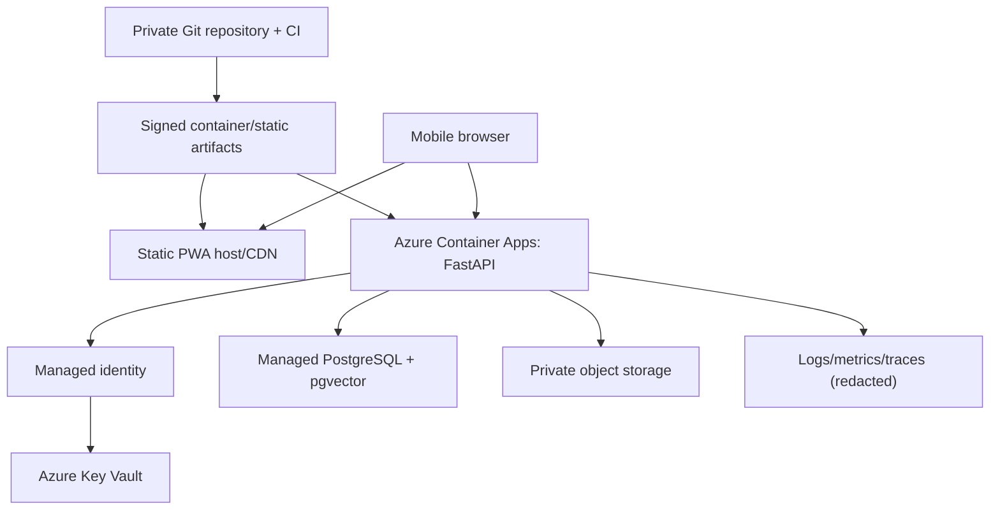

# Deployment and DevOps

## Purpose

Provide a low-cost local/demo path and a secure pilot evolution.

## Decision

Local development uses Node/pnpm, Python virtual environment, FastAPI, and Dockerized PostgreSQL/pgvector. Mock mode needs neither database container nor external keys. CI validates contracts/docs, runs tests/scans, builds immutable artifacts and emits an SBOM. No deployment occurs from unreviewed forks with secrets.

Demo deployment: static PWA hosting plus one Azure Container Apps (or App Service if demonstrably simpler/cheaper) FastAPI container and managed PostgreSQL only when student credit allows. Pilot adds managed PostgreSQL, Key Vault, object storage/CDN, monitoring, backups and custom domain/TLS. Container Apps uses managed identity and Key Vault references; permanent provider keys never enter image/build args.

Environments are local, demo and pilot with separate resources/keys/data. Infrastructure-as-code is post-Phase-1 but required before pilot. Database migrations run as a one-off least-privilege job after backup and compatibility check. Deployment is rolling/blue-green where service supports it; health requires database and internal readiness but does not fail solely because an optional provider is down.

Backups: daily encrypted `pg_dump` locally during project, weekly offline/second-cloud copy, weekly automated integrity check and monthly restore drill. Pilot uses provider PITR plus export. Asset manifest stores SHA-256 and licence proof. Git is not backup for databases or nonredistributable assets.

Rollback restores previous image/config; forward-fix migrations must be backward-compatible for one release. Provider/feature kill switches are server-side. Secrets rotate between development/demo and after suspected exposure.

## Alternatives considered

Kubernetes and microservice deployment add cost/operations. One VM is cheap but makes secret rotation/TLS/rollback more manual. Final selection is cost-tested during Phase 6.

## Reasoning

Managed identity and one container preserve a simple path while avoiding keys in code.

## Risks

Student quota/region limitations, cold starts, unexpected egress, and OneDrive workspace behavior. Maintain local demo, budget alerts and pre-demo offline/mock rehearsal.

## Acceptance criteria

- Clean environment can reproduce validated build from lockfiles.
- No secret appears in bundle/image/SBOM/log.
- Restore drill meets demo RPO 24 h/RTO 4 h; pilot targets decided later.
- Rollback and provider kill switch are demonstrated.

## Sources verified 2026-07-30

[Azure Container Apps Key Vault references](https://learn.microsoft.com/en-us/azure/container-apps/manage-secrets), [Azure for Students offer](https://azure.microsoft.com/en-us/free/students).

